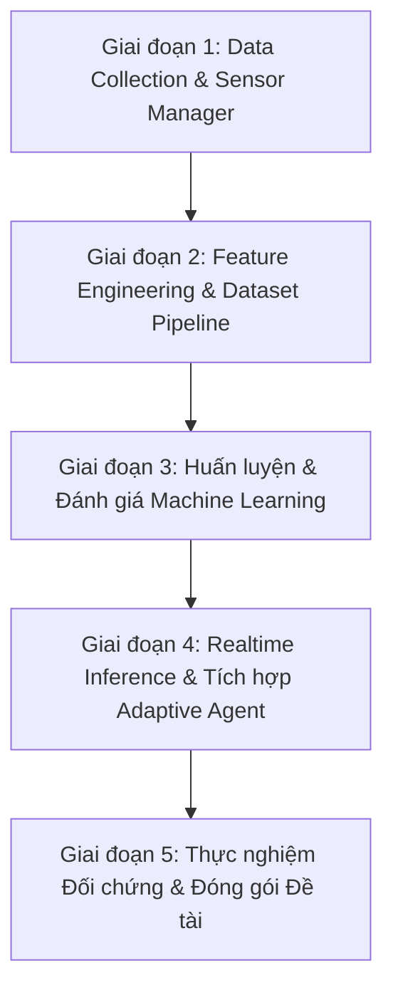

# Kế Hoạch Phát Triển Hệ Thống Trợ Giảng Excel Thích Ứng (ML + AI Agent)

> **Căn cứ tài liệu**: [Ke_hoach_Excel_AI_Tutor_ML_Agent.docx](file:///c:/Users/ADMIN/Desktop/AI%20EXCEL%20ADATIPVE/Ke_hoach_Excel_AI_Tutor_ML_Agent.docx)  
> **Trọng tâm đề tài**: Thu thập dữ liệu hành vi tương tác thời gian thực $\rightarrow$ Trích xuất đặc trưng $\rightarrow$ Huấn luyện Machine Learning phát hiện trạng thái học tập (`NORMAL`, `HESITATING`, `CONFUSED`, `STUCK`, `MASTERED`) $\rightarrow$ AI Agent đưa ra trợ giúp sư phạm thích ứng (`Adaptive Feedback Level 0 - 3`).

---

## Lộ Trình Phát Triển 5 Giai Đoạn (Tách Nhỏ Từng Bước Để Dễ Quản Lý)

---

### GIAI ĐOẠN 1: HỆ THỐNG THU THẬP DỮ LIỆU & SENSOR MANAGER (DATA COLLECTION SYSTEM)
*Mục tiêu: Xây dựng nền móng thu thập dữ liệu hành vi tương tác phong phú, chính xác, không gây lag Excel.*

- [ ] **Bước 1.1: Chuẩn hóa kiến trúc `SensorManager` đa kênh**
  - Tách các cảm biến thành các module độc lập theo tài liệu:
    - `SelectionSensor`: Lắng nghe địa chỉ ô, phạm vi vùng chọn, số hàng/cột (`SelectionChange`).
    - `CellValueSensor`: Theo dõi giá trị nhập, kiểu dữ liệu, định dạng số, dấu hiệu lỗi công thức.
    - `MouseSensor`: Đo tốc độ chuột Win32, thời gian ngập ngừng (idle), quãng đường rê chuột.
    - `TimingSensor`: Đo thời gian thực hiện bước (`time_on_task`), thời gian sau khi làm sai (`time_after_error`).
    - `RibbonSensor` & `WindowSensor`: Ghi nhận chuyển tab Ribbon, trạng thái cửa sổ Excel active/inactive.
  - Duy trì cơ chế **Selective/Lazy Sensing** để tối ưu hiệu năng Zero-Lag.

- [ ] **Bước 1.2: Thiết kế Cơ sở dữ liệu Cục bộ SQLite & Schema chuẩn**
  - Khởi tạo file CSDL `data/excel_tutor.db` với các bảng theo thiết kế:
    - `students`: Quản lý thông tin/mã học viên.
    - `sessions`: Phiên thực hành (bắt đầu, kết thúc, mã bài tập, kết quả).
    - `events`: Lưu toàn bộ dòng sự kiện thô (Raw Event Stream) gồm `event_id`, `session_id`, `timestamp`, `event_type`, `cell`, `metadata` (JSON).

- [ ] **Bước 1.3: Xây dựng `EventLogger` bất đồng bộ (Non-blocking)**
  - Thu gom sự kiện qua hàng đợi `queue.Queue` và ghi xuống SQLite theo khối (Batching / WAL mode) để đảm bảo không làm giật khung hình GUI hoặc chậm vòng lặp Excel COM.

- [ ] **Bước 1.4: Tích hợp Logger vào `ExcelObserverWorker`**
  - Kích hoạt ghi log tự động khi học viên mở bài tập và thực hành.

- [ ] **Bước 1.5: Công cụ kiểm chứng `EventTimelineViewer`**
  - Tạo công cụ trực quan hóa đơn giản (GUI/CLI) để kiểm tra dòng sự kiện thu được trong phiên thực hành (xác thực tính đầy đủ và đúng thứ tự thời gian của sự kiện).

---

### GIAI ĐOẠN 2: FEATURE ENGINEERING & DATASET PIPELINE
*Mục tiêu: Chuyển đổi hàng nghìn sự kiện thô thành Feature Vectors có ý nghĩa sư phạm và xây dựng quy trình gán nhãn khoa học.*

- [ ] **Bước 2.1: Thiết kế Feature Vector Schema**
  - Xây dựng 4 nhóm đặc trưng hành vi cốt lõi:
    - *Nhóm Thời gian (Timing)*: `time_on_task`, `time_before_first_action`, `time_after_error`.
    - *Nhóm Hành vi Chuột (Mouse)*: `mouse_speed_mean`, `mouse_idle_avg`, `mouse_idle_max`, `erratic_movement_count`.
    - *Nhóm Lỗi & Thao tác (Interaction & Errors)*: `selection_changes`, `wrong_attempts`, `formula_errors`, `undo_count`, `retry_count`.
    - *Nhóm Hiệu suất (Performance)*: `hint_requests`, `completion_rate`.

- [ ] **Bước 2.2: Xây dựng `FeatureBuilder` theo Time-Window & Session**
  - Gom sự kiện theo cửa sổ thời gian (Sliding Window 15s/30s) hoặc theo từng vi-bước bài học để tính toán vector đặc trưng.

- [ ] **Bước 2.3: Xây dựng Giao thức Gán nhãn (Labeling Protocol)**
  - Triển khai theo 3 nguồn nhãn:
    - *Task Outcome*: Tự động xác định qua logic kiểm thử COM (đúng/sai, thời gian hoàn thành).
    - *Heuristic Rules*: Quy tắc ban đầu cho 3 trạng thái cơ bản (`NORMAL`, `DIFFICULT`, `STUCK`).
    - *Teacher/Expert Review*: Cho phép xem lại session timeline để hiệu chỉnh nhãn.

- [ ] **Bước 2.4: Trích xuất & Phân chia Dataset (Dataset Split)**
  - Chia dữ liệu theo danh tính học viên (Student-wise Split: 70% Train, 15% Validation, 15% Test) để **ngăn chặn rò rỉ dữ liệu (Data Leakage)**.
  - Lưu trữ dưới dạng parquet/csv có phiên bản (`Dataset v1.0`).

---

### GIAI ĐOẠN 3: HUẤN LUYỆN & ĐÁNG GIÁ MÔ HÌNH MACHINE LEARNING
*Mục tiêu: Huấn luyện các mô hình phân loại trạng thái học tập và phân tích tầm quan trọng của các đặc trưng.*

- [ ] **Bước 3.1: Huấn luyện mô hình Baseline**
  - Thử nghiệm các mô hình Tabular truyền thống: Logistic Regression, Decision Tree, Random Forest.
  - Thiết lập baseline chuẩn cho bài toán phân loại đa lớp (Multi-class classification).

- [ ] **Bước 3.2: Huấn luyện mô hình nâng cao (Gradient Boosting)**
  - Áp dụng XGBoost / LightGBM, tinh chỉnh siêu tham số (Hyperparameter Tuning qua Cross-Validation).

- [ ] **Bước 3.3: Đánh giá mô hình toàn diện**
  - Đo lường: Accuracy, Precision, Recall, Macro F1-Score, Confusion Matrix.
  - Phân tích sâu **False Positive** và **False Negative** ở trạng thái `STUCK` (tránh can thiệp sai khi học viên đang tự tư duy, hoặc bỏ sót khi học viên thực sự bế tắc).

- [ ] **Bước 3.4: Phân tích Feature Importance**
  - Dùng SHAP / Gini Importance để làm sáng tỏ: *Nhóm hành vi nào (Chuột, Thời gian, hay Thao tác lỗi) phản ánh rõ nhất việc người học gặp khó khăn?*

- [ ] **Bước 3.5: Đóng gói mô hình phục vụ suy luận thời gian thực**
  - Export mô hình nhẹ (`model.joblib` / `ONNX`) tối ưu hóa tốc độ suy luận (< 2ms).

---

### GIAI ĐOẠN 4: REALTIME INFERENCE & TÍCH HỢP ADAPTIVE AI AGENT
*Mục tiêu: Đưa mô hình ML vào hoạt động song hành cùng Excel COM và điều phối gợi ý thích ứng đa cấp độ.*

- [ ] **Bước 4.1: Xây dựng `RealtimeFeatureExtractor`**
  - Tính toán nhanh feature vector từ sliding buffer trong bộ nhớ RAM mà không cần truy vấn lại đĩa cứng.

- [ ] **Bước 4.2: Tích hợp `MLInferenceEngine` vào Worker Thread**
  - Dự đoán `student_state` và `confidence` theo chu kỳ nhẹ (mỗi 1-2 giây hoặc khi phát hiện chuỗi hành vi bất thường).

- [ ] **Bước 4.3: Nâng cấp `DecisionEngine` trong `RealtimeTeachingAgent`**
  - Tách bạch rõ vai trò theo Table 1 của tài liệu:
    - *ML Model*: Dự đoán trạng thái người học (`NORMAL`, `HESITATING`, `CONFUSED`, `STUCK`, `MASTERED`).
    - *Lesson Engine*: Xác định vi-bước hiện tại.
    - *Decision Engine*: Kết hợp ML state + context bài học + lịch sử gợi ý để quyết định cấp độ hỗ trợ:
      - `Level 0 - NORMAL`: Im lặng, để học viên tự do khám phá.
      - `Level 1 - Gợi ý nhẹ`: Đặt câu hỏi gợi mở tư duy.
      - `Level 2 - Định hướng công cụ`: Chỉ rõ Ribbon/Công thức cần dùng.
      - `Level 3 - Hướng dẫn từng bước & Overlay`: Khoanh đỏ trực quan mục tiêu.

- [ ] **Bước 4.4: Hoàn thiện đồng bộ UI Companion Widget & Mascot**
  - Cập nhật cảm xúc Mascot (Tự tin, Suy nghĩ, Cảnh báo, Cổ vũ) tương ứng với trạng thái ML dự đoán.

---

### GIAI ĐOẠN 5: THÍ NGHIỆM THỰC NGHIỆM & ĐÓNG GÓI ĐỀ TÀI
*Mục tiêu: Đánh giá hiệu quả sư phạm thực tế và tạo lập dữ liệu nghiên cứu khoa học.*

- [ ] **Bước 5.1: Thiết lập 4 bài thí nghiệm nghiên cứu (Theo Mục XVIII)**
  - *Experiment 1*: So sánh hiệu quả giữa Logistic Regression, Random Forest và XGBoost.
  - *Experiment 2*: Đánh giá mức độ đóng góp của từng nhóm đặc trưng (Timing-only vs Timing+Error vs Timing+Error+Mouse).
  - *Experiment 3*: Thử nghiệm chuỗi thời gian (Tabular vs LSTM/GRU nếu dataset đủ lớn).
  - *Experiment 4*: So sánh đối chứng giữa Hệ thống Hỗ trợ Cố định vs Hệ thống Thích ứng dựa trên ML (Đo thời gian hoàn thành, số lỗi, số lần yêu cầu trợ giúp, mức tăng điểm nhận thức).

- [ ] **Bước 5.2: Xuất báo cáo khoa học & Artifacts**
  - Báo cáo trực quan hóa đồ thị ma trận nhầm lẫn (Confusion Matrix), đồ thị phân phối thời gian, và bảng phân tích định lượng phục vụ bài báo/khóa luận nghiên cứu.

---

## Đề Xuất Bắt Đầu Ngay

Tôi khuyến nghị chúng ta bắt đầu ngay với **GIAI ĐOẠN 1**:
1. Tạo module cảm biến **`src/sensors/`** và lớp gom **`SensorManager`**.
2. Xây dựng CSDL SQLite **`data/excel_tutor.db`** và module **`EventLogger`**.
3. Kết nối ghi nhận sự kiện từ các bài tập hiện có (Bài 07 & Bài 08).
